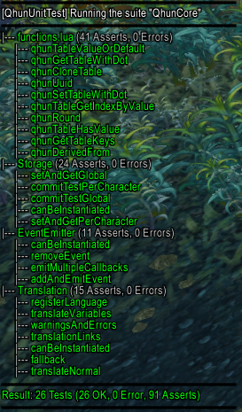

# QhunUnitTest

Lua as an interpreter language without and support for good code intelligence and suggestion is a difficult to write language. With the technically old World of Warcraft addon API the task is even harder.

In the past i have written many addons and any change to some feature resulted in a may work or may not work situation. I have to test everything myself and this is time and happyness consuming :). Without further ado i present you an object oriented unit test framework for World of Warcraft addons.

I adopted the common unit test design patterns and names from other languages like php, java and typescript to allow easy step in into unit testing with World of Warcraft and Lua.

Happy testing!

# Support

The following main features were supported:
- Testsuites
- A bunch of assert functions
- Setup and teardown on class and method level
- Easy to understand result print
- Ingame command line interface
- Count of tests, errors and asserts
- Powerfull abstract test class for your component
- Wrapping / Mocking existing objects to test for method calls (even with exact arguments)
- An Error per test system (All tests will run, even if one failed)

# Contribution

If you want to contribute to this addon, please develop your features/bug fixes on a fork of this project. You can then make a pull request and we can discuss the changes within a separate ticket.

# Example

This is a simple test class.

```lua
if not IsAddOnLoaded("QhunUnitTest") then
    return
end

QhunCore.Test.Storage = {}
QhunCore.Test.Storage.__index = QhunCore.Test.Storage

-- constructor
function QhunCore.Test.Storage.new()

    -- call super class
    local instance = QhunUnitTest.Base.new()

    -- bind current values
    setmetatable(instance, QhunCore.Test.Storage)

    return instance
end

-- set inheritance
setmetatable(QhunCore.Test.Storage, {__index = QhunUnitTest.Base})

--[[
    TESTS
]]
-- the name of the method will be visible in the test report
function QhunCore.Test.Storage:canBeInstantiated()

    -- create a storage instance
    local instance = QhunCore.Storage.new()

    -- test if the returned instance is a class of type QhunCore.Storage
    self:assertClassOf(instance, QhunCore.Storage)
end
```

The test class should be registered in your test suite. This is a testsuite example:

```lua
-- check if the unit test addon is available
if IsAddOnLoaded("QhunUnitTest") then

    -- create a test suite
    local suite = QhunUnitTest.Suite.new("QhunCore")

    -- register the defined test class
    suite:registerClass("Storage", QhunCore.Test.Storage.new())

    -- register for slash
    suite:registerForSlashCommand()
end
```

You now can access the ingame command line api to show the result of the test. The command looks like `/test QhunCore`. You will see a result like this (I have done some more tests):



# API

View the Wiki page for a detailed documentation of every feature. I am currently working on the documentation :)

# Licence

MIT style licence, see licence file for more details